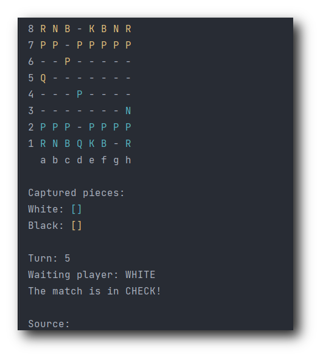
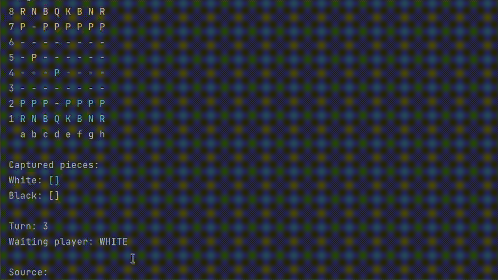

# Chess System




> Um jogo de xadrez feito totalmente em JAVA para o seu shell!

## 📋 Ajustes e melhorias

O projeto ainda está em desenvolvimento e as próximas atualizações serão voltadas nas seguintes tarefas:

- [ ] Criar lógica para _ROQUE_
- [ ] Criar lógica para _En Passant_
- [ ] Criar lógica para _Promoção do Peão_
- [ ] Refatoração das classes
- [ ] Criação de testes unitários

## 💻 Pré-requisitos

⚠️ Antes de começar, verifique se você atendeu aos seguintes requisitos:

* Instalou a versão mais recente do `Java`
* Tem uma máquina com `Windows, Linux ou Mac`.

## ☕ Usando Chess System



Para usar Chess System, siga estas etapas:

```zsh
git@github.com:deverebor/chess-system.git
```

> Clone o reposítorio do projeto.

```zsh
cd chess-system
```

> Entre na pasta do projeto.

```zsh
java application/Program
```

> Execute o programa.

## 📫 Contribuindo para Chess System
Viu algum ponto a ser melhorado, ou quer simplesmente ajudar? Para contribuir com Chess System, siga estas etapas:

1. Fork este repositório.
2. Crie um branch: `git checkout -b main`.
3. Faça suas alterações e confirme-as: `git commit -m '<mensagem_commit>'`
4. Envie para o branch original: `git push origin deverebor/chess-system:main`.
5. Crie a solicitação de pull.

Como alternativa, consulte a documentação do GitHub em [como criar uma solicitação pull](https://help.github.com/en/github/collaborating-with-issues-and-pull-requests/creating-a-pull-request).

## 🤝 Colaboradores

Agradecemos às seguintes pessoas que contribuíram para este projeto:

<table>
  <tr>
    <td align="center">
      <a href="https://www.linkedin.com/in/lucas-souza-dev/">
        <br>
        <sub>
          <b>Lucas Souza</b>
        </sub>
      </a>
    </td>
  </tr>
</table>

[⬆ Voltar ao topo](#nome-do-projeto)
